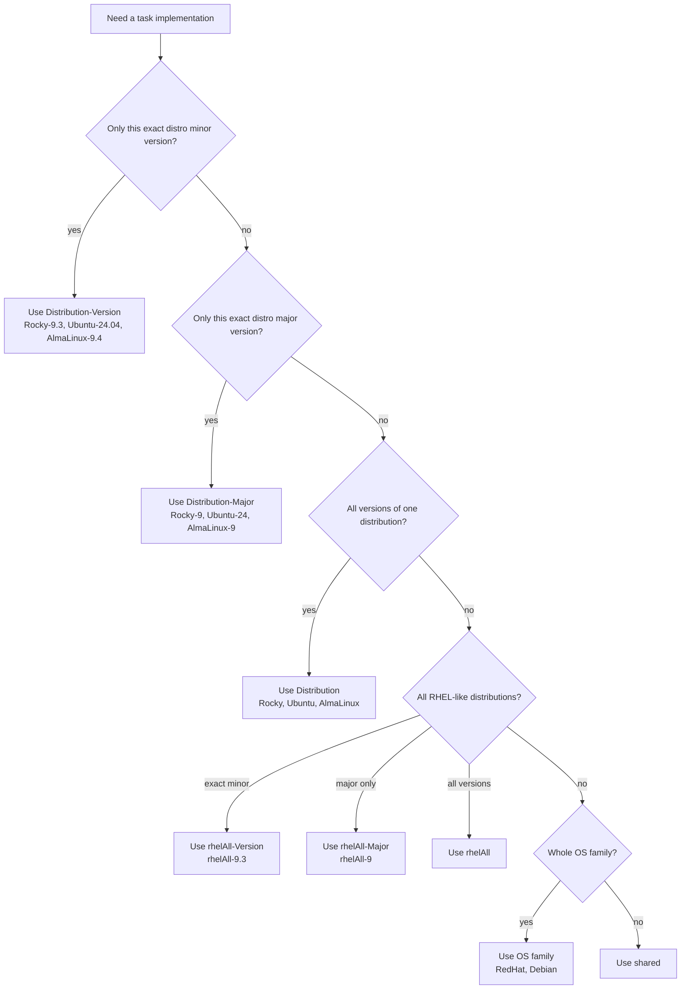

# Bitbull Ansible Role Template

This repository is a reusable Ansible role template for OS-aware roles. It keeps
execution order deterministic while selecting the best task implementation for
each target host from Ansible facts.

The template is intended for both humans and AI agents: keep the dispatcher
files stable, replace the demo task files with real role logic, and document the
role-specific variables and validation commands.

## Start a new role from this template

1. Copy or generate a new repository named `ansible.<role_name>`.
2. Update `meta/main.yml`:
   - `role_name: <role_name>`
   - `description:`
   - `platforms:`
   - `galaxy_tags:`
3. Update `tests/test.yml` to use the final Galaxy role name:
   - `joe-speedboat.<role_name>`
4. Replace the demo variables:
   - `defaults/main.yml` for user-overridable variables
   - `vars/main.yml` for fixed internal maps and constants
5. Replace or remove all demo task files:
   - `tasks/shared/01_run_on_all_systems.yml`
   - `tasks/shared/10_prep.yml`
   - `tasks/shared/20_setup.yml`
   - `tasks/shared/30_post.yml`
   - `tasks/Rocky-8/20_setup.yml`
   - `tasks/Rocky-8/30_post.yml`
   - `tasks/Rocky-9/10_prep.yml`
6. Keep `.gitstay` files only for empty task folders you want to preserve.
7. Replace `handlers/main.yml` with real handlers or an empty handler file.
8. Put static files in `files/` and Jinja2 templates in `templates/`.
9. Rewrite this README for the real role: purpose, variables, examples,
   supported OSes, and validation steps.
10. Run the test harness from `tests/README.md` before publishing.

## Do not change lightly

These two files are the template dispatcher contract:

- `tasks/main.yml` discovers task basenames and includes them in sorted order.
- `tasks/include-file.yml` chooses the first existing OS-specific implementation
  for each basename.

Change them only when you intentionally change the template behavior. Normal
role work belongs in numbered task files below `tasks/shared/`,
`tasks/rhelAll/`, `tasks/Ubuntu/`, `tasks/Rocky-9/`, and similar folders.

## How task dispatch works

`tasks/main.yml` discovers every task file matching this pattern below
`tasks/`:

```text
^[0-9]{2}_.*.yml$
```

It reduces the result to unique basenames, sorts them, and includes each
basename once through `tasks/include-file.yml`.

For each basename, `tasks/include-file.yml` uses the first existing file from
this order:

```text
tasks/{{ ansible_distribution }}-{{ ansible_distribution_version }}/<task>.yml
tasks/{{ ansible_distribution }}-{{ ansible_distribution_major_version }}/<task>.yml
tasks/{{ ansible_distribution }}/<task>.yml
tasks/{{ ansible_distribution_combine }}-{{ ansible_distribution_version }}/<task>.yml
tasks/{{ ansible_distribution_combine }}-{{ ansible_distribution_major_version }}/<task>.yml
tasks/{{ ansible_distribution_combine }}/<task>.yml
tasks/{{ ansible_os_family }}/<task>.yml
tasks/shared/<task>.yml
```

`ansible_distribution_combine` is `rhelAll` for `AlmaLinux`, `Rocky`, and
`RedHat`. For other distributions the `rhelAll` lookup steps simply do not
match a real folder, so dispatch continues to OS-family and `shared` fallbacks.

## Folder naming rules

Use the most general folder that is still correct. More specific folders win
because they are checked first.

For a Rocky Linux 9.3 host and task basename `20_setup.yml`, the dispatcher
tries this complete ordered set:

```text
tasks/Rocky-9.3/20_setup.yml      # exact distribution + exact version
tasks/Rocky-9/20_setup.yml        # exact distribution + major version
tasks/Rocky/20_setup.yml          # exact distribution, all versions
tasks/rhelAll-9.3/20_setup.yml    # RHEL-like family + exact version
tasks/rhelAll-9/20_setup.yml      # RHEL-like family + major version
tasks/rhelAll/20_setup.yml        # RHEL-like family, all versions
tasks/RedHat/20_setup.yml         # Ansible OS family fallback
tasks/shared/20_setup.yml         # global fallback
```

For Ubuntu 24.04, the same basename resolves through the non-`rhelAll` path:

```text
tasks/Ubuntu-24.04/20_setup.yml   # exact distribution + exact version
tasks/Ubuntu-24/20_setup.yml      # exact distribution + major version
tasks/Ubuntu/20_setup.yml         # exact distribution, all versions
tasks/Debian/20_setup.yml         # Ansible OS family fallback
tasks/shared/20_setup.yml         # global fallback
```



| Folder | Use for |
|---|---|
| `tasks/Rocky-9.3/` | One exact distribution minor version. Highest precedence. |
| `tasks/Rocky-9/` | One distribution major version. |
| `tasks/Rocky/` | All versions of one distribution. |
| `tasks/rhelAll-9.3/` | Exact minor version across AlmaLinux, Rocky, and Red Hat. |
| `tasks/rhelAll-9/` | Major version across AlmaLinux, Rocky, and Red Hat. |
| `tasks/rhelAll/` | All supported AlmaLinux, Rocky, and Red Hat versions. |
| `tasks/Ubuntu-24.04/` | One exact Ubuntu minor version. |
| `tasks/Ubuntu-24/` | One Ubuntu major version. |
| `tasks/Ubuntu/` | All Ubuntu versions. |
| `tasks/Debian/` | Debian-family logic when it is safe for Ubuntu too. |
| `tasks/shared/` | Logic that must run on every supported OS. Lowest precedence. |

Do not use `tasks/RedHat/` as the normal abstraction for all RHEL-like systems;
use `tasks/rhelAll/`, `tasks/rhelAll-9/`, or `tasks/rhelAll-9.3/` for that.

## Task file rules

- Use two-digit numeric prefixes: `10_prep.yml`, `20_setup.yml`, `30_post.yml`.
- Keep the same basename in multiple folders when you want OS-specific
  implementations of the same step.
- Put common work that must always run under its own basename, for example
  `05_validate.yml`, so it is not shadowed by an OS-specific `10_prep.yml`.
- End YAML files with `...`.
- Prefer `ansible.builtin.*` fully qualified module names.
- Use clear task names that describe the effect, not just the module.

Example:

```text
tasks/shared/05_validate.yml
tasks/rhelAll/10_install.yml
tasks/Ubuntu/10_install.yml
tasks/shared/20_configure.yml
tasks/shared/30_service.yml
```

## Basename shadowing example

If these files exist:

```text
tasks/rhelAll/20_setup.yml
tasks/Ubuntu/20_setup.yml
tasks/shared/20_setup.yml
```

then RHEL-like and Ubuntu hosts do **not** run `tasks/shared/20_setup.yml`.
They run only the first OS-specific match. Move shared logic to another
basename such as `tasks/shared/15_common.yml` or `tasks/shared/25_configure.yml`.

## Files and directories

| Path | Purpose |
|---|---|
| `defaults/main.yml` | User-overridable variables. Document every public variable in the role README. |
| `vars/main.yml` | Fixed internal maps/constants that users normally should not override. |
| `handlers/main.yml` | Handlers notified by tasks, for example service restart/reload. |
| `files/` | Static files copied unchanged with `ansible.builtin.copy`. |
| `templates/` | Jinja2 templates rendered with `ansible.builtin.template`. |
| `tests/test.yml` | Minimal syntax/runtime smoke test for the template dispatcher. |
| `tests/README.md` | Local harness instructions. |

## Requirements

- Ansible 2.9 or higher
- Fact gathering enabled before this role runs, so `ansible_distribution`,
  `ansible_distribution_major_version`, and `ansible_os_family` are available

## Installation

```bash
ansible-galaxy install joe-speedboat.template
```

## Validation

Use the harness documented in `tests/README.md`. Do not run only from the role
checkout; the dispatcher expects the role to be installed below a `roles/`
directory, as it is in normal Ansible/AWX usage.

At minimum run:

```bash
ANSIBLE_ROLES_PATH=roles ansible-playbook /path/to/ansible.template/tests/test.yml -i localhost, -c local --syntax-check
ANSIBLE_ROLES_PATH=roles ansible-playbook /path/to/ansible.template/tests/test.yml -i localhost, -c local
```

For a real role, add target-host tests, idempotency checks, and independent
verification of the changes the role is supposed to make.

## License

GPL-3.0: <https://opensource.org/licenses/GPL-3.0>

Copyright (c) Chris Ruettimann <chris@bitbull.ch>
